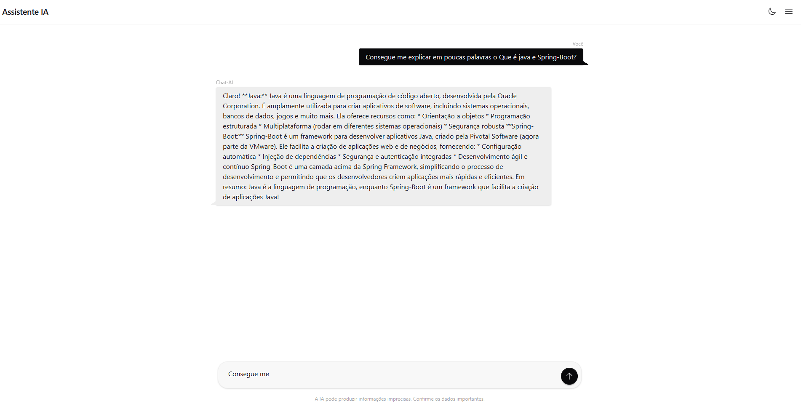
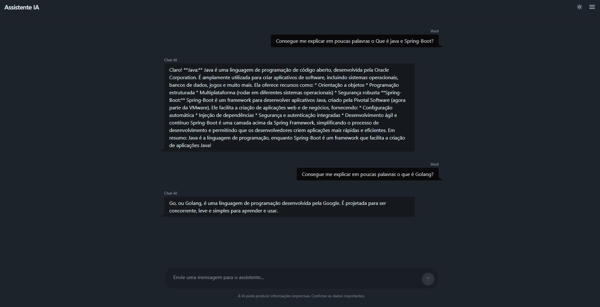

# chat-ai

Projeto fullstack com:

- Backend: Spring Boot 3.5 + Spring AI + PostgreSQL + Flyway
- Frontend: Angular 21 (pasta `UI/`)

## Arquitetura rapida

- API principal: `POST /test-message`
- Backend default: `http://localhost:8080`
- Frontend Angular default: `http://localhost:4200`
- Contrato detalhado da API para agentes: `AI_AGENT_API_CONTRACT.md`

## Requisitos

- Java 21
- Node.js 22+ (recomendado para Angular 21)
- NPM 10+
- PostgreSQL em execucao

## Configuracao de ambiente (backend)

1. Copie o arquivo de exemplo:

```powershell
Copy-Item .env.example .env
```

2. Edite o `.env` com suas credenciais e chaves.

Variaveis:

- `DB_HOST`
- `DB_PORT`
- `DB_NAME`
- `DB_USER`
- `DB_PASSWORD`
- `MODEL_TO_USE` (`gemini` ou `ollama`)
- `GEMINI_API_KEY`
- `GEMINI_MODEL`
- `OLLAMA_BASE_URL`
- `OLLAMA_MODEL`

## Banco e migrations

- Banco: PostgreSQL (`org.postgresql.Driver`)
- Flyway habilitado com scripts em `src/main/resources/db/migration`
- Migrations atuais:
  - `V1__create_history_table.sql`
  - `V2__add_model_and_vendor_to_history.sql`

## Rodando o backend

```powershell
.\mvnw.cmd spring-boot:run
```

## Rodando o frontend (Angular 21)

```powershell
Set-Location .\UI
npm install
npm start
```

Obs: hoje o frontend chama o backend em `http://localhost:8080/test-message` (ver `UI/src/app/pages/chat/services/chat.service.ts`).

## Testes

Backend:

```powershell
.\mvnw.cmd test
```

Frontend:

```powershell
Set-Location .\UI
npm test
```

## Screenshots

### Light mode



### Dark mode



